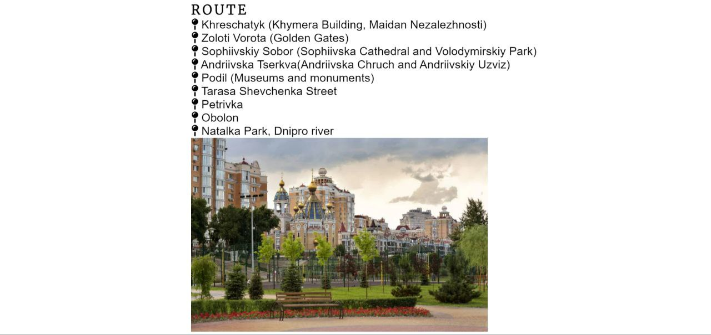

# Kyiv Tour

Kyiv Tour is a site that gives an opportunity to sightsee and hear the history of places in Kyiv. The site will be targeted toward tourists and those city residents who want to learn more about their city. 

# Existing features
## Navigation bar:
Includes links to Home, Tour, Meet Up Time, Sign Up and Contact Us. This section will allow the user to easily navigate from one section to another.

## Home section
It's a photograph of Khreschatyk, Kyiv's center. The section introduces people to the company. 

## Tour's route
It's a section with tour's route so a person knows what to expect. This section also includes an image of the final destination, Natalka park. 

## Meet Up 
This section provides a user with start times of the tour.

## Register for tour
This section gives an opportunity to sign up for tour.

## The Footer
This section provides a user with ways to contact the company. Every link opens in a new tab.
 

# Testing
The site looks good on different screens. Images aren't distorted, font size depends on the screen width and meet up times aren't on one line.

-HTML:
No errors were returned when passing through the official W3C validator

-CSS:
No errors were found when passing through the official (Jigsaw) validator

# Deployment
The site was deployed to GitHub pages. The steps to deploy are as follows:

-In the GitHub repository, navigate to the Settings tab

-From the source section drop-down menu, select the Master Branch

-Once the master branch has been selected, the page will be automatically refreshed with a detailed ribbon display to indicate the successful deployment

The live link can be found here- https://pozhara.github.io/Kyiv-Tour/

# Credits
-Content:

The icons in the route section and the footer were taken from Font Awesome.

The code for the header was taken from Code Institute's Love Running project.

Instructions on how to put registration form on an image was taken from GeeksforGeeks (url: https://www.geeksforgeeks.org/how-to-add-a-login-form-to-an-image-using-html-and-css/)

The code for vertically aligning text next to the image was taken from w3docs.com (url: https://www.w3docs.com/snippets/css/how-to-vertically-align-text-next-to-an-image.html)

How to fix the right-side white space problem was found in Harshit Tewari's YouTube video (url: https://www.youtube.com/watch?v=OASSKoiCfqY)

The code to outline text was taken from codescope (url: https://www.codesdope.com/blog/article/adding-outline-to-text-using-css/)

-Media:

Khreschatyk image was taken from Hotel Khreschatyk Kiev webpage (url: https://www.hotel-khreschatyk.kiev.ua/en/about-hotel/hotel-photo-gallery)

Natalka park image was taken from depositphotos.com webpage (url: https://ru.depositphotos.com/stock-photos/natalka-park.html)

Kyiv image was taken from bestkyivguide.com (url: https://www.bestkievguide.com/kiev-guide-2/kiev-sightseeng/podil-the-lower-town/)